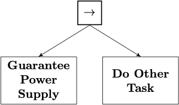
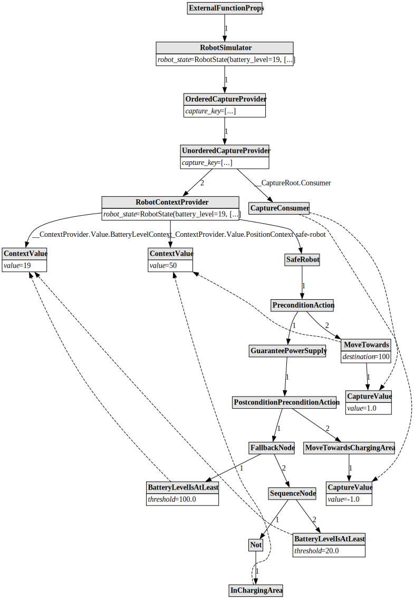
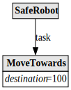
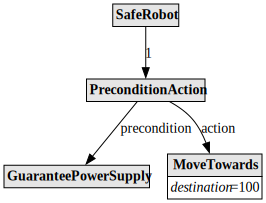

# pybt2

[](https://codecov.io/gh/GrahamDennis/pybt2)
[](https://github.com/GrahamDennis/pybt2/actions/workflows/main.yml)

pybt2 is a [React][react]-inspired incremental [behaviour tree][behaviour-tree] library.

* **React-inspired**: Behaviour Trees are defined in Python, and each node can dynamically construct its children on each tick. Data can be implicitly passed into children via Contexts, and in-tree state is supported via [React-like hooks][react-hooks] like `use_state`, `use_effect` or `use_async`. No stringly-typed blackboards here!
  Although child nodes are dynamically constructed on each tick, each child node has an identifying key path that can be used to identify corresponding nodes between ticks to propagate state as required.
* **incremental**: The complete tree isn't evaluated on each tick, only the parts that are out-of-date. `pybt` tracks data dependencies between nodes and memoizes node arguments and return values to only re-run nodes that need to be.

  Behind-the-scenes, `pybt2` has an runtime that supports incremental execution of call graphs of functions returning any data, not just the standard behaviour-tree values of `Success`, `Running` or `Failure`. 

## A simple example

Consider the behaviour described in §5.4.2 of [Behavior Trees in Robotics and AI][bt-paper]:



Where the "Guarantee Power Supply" moves the robot towards the charging station if the power level is less than 20%. This Behaviour Tree can be described in pybt2 as (see [robot.py](./tests/behaviour_tree/robot.py)):

```python
from attrs import frozen
from pybt2.behaviour_tree.types import BTNode, BTNodeResult
from pybt2.runtime.fibre import CallContext
from pybt2.behaviour_tree.nodes import (
  PreconditionAction, PostconditionPreconditionAction, AnyOf, AllOf, Not
)

@frozen
class SafeRobot(BTNode):
    """
    Root behaviour tree node that ensures there's sufficient power before performing some
    other task.
    """
    task: BTNode

    def __call__(self, ctx: CallContext) -> BTNodeResult:
        return PreconditionAction(precondition=GuaranteePowerSupply(), action=self.task)


@frozen
class GuaranteePowerSupply(BTNode):
    """
    A subtree to maintain sufficient battery charge.
    
    If the battery level falls below 20%, then move the robot towards the charging area and
    charge until full.
    """
    def __call__(self, ctx: CallContext) -> BTNodeResult:
        return PostconditionPreconditionAction(
            postcondition=AnyOf(
                BatteryLevelIsAtLeast(100.0),
                AllOf(Not(InChargingArea()), BatteryLevelIsAtLeast(20.0))
            ),
            actions=[MoveTowardsChargingArea()],
        )


@frozen
class BatteryLevelIsAtLeast(BTNode):
    """
    A condition node that reads the current battery level from the battery context using a
    React-inspired use_context hook.
    """
    threshold: float

    def __call__(self, ctx: CallContext) -> BTNodeResult:
        return use_context(ctx, BatteryLevelContextKey) > self.threshold


@frozen
class InChargingArea(BTNode):
    """
    A condition node that reads the current vehicle position from the position context using
    a React-inspired use_context hook.
    """
    def __call__(self, ctx: CallContext) -> BTNodeResult:
        return use_context(ctx, PositionContextKey) < 0.1


@frozen
class MoveTowardsChargingArea(BTNode):
    """
    Move the robot towards the charging area (position 0.0 of 0.0 to 100.0).
    """
    def __call__(self, ctx: CallContext) -> BTNodeResult:
        use_capture(ctx, RobotVelocityDemandsCaptureKey, -1.0)
        return Running()


@frozen
class MoveTowards(BTNode):
    """
    Move the robot towards an arbitrary position, slowing down as it approaches the target.
    """
    destination: float

    def __call__(self, ctx: CallContext) -> BTNodeResult:
        current_position = use_context(ctx, PositionContextKey)
        desired_velocity = (self.destination - current_position) / 50.0
        use_capture(ctx, RobotVelocityDemandsCaptureKey, desired_velocity)
        return Running()

```

This Behaviour Tree references two Contexts, the `BatteryLevelContextKey` and the `PositionContextKey` that are implicitly passed into the tree above by a Context Provider:

```python
@frozen
class RobotState:
    battery_level: float
    position: float

@frozen
class RobotContextProvider(BTNode):
    robot_state: RobotState
    child: BTNode

    def __call__(self, ctx: CallContext) -> BTNodeResult:
        return ctx.evaluate_inline(
            BatchContextProvider(
                contexts={
                    BatteryLevelContextKey: self.robot_state.battery_level,
                    PositionContextKey: self.robot_state.position,
                },
                child=self.child,
            )
        )
```

The full behaviour tree and its data dependencies can be visualised by running the tree in "analysis mode" (see `TestRobotVisualisation` in [`tests/behaviour_tree/test_robot.py`](tests/behaviour_tree/test_robot.py)):



In the diagram above:

* Solid lines point from parent nodes to child nodes. These lines are labelled with the key that uniquely identifies this child in its parent node.
* Dashed lines point from nodes to their long-range data dependencies. For example the nodes that read from the battery-level context or the robot position context have dashed arrows to those values stored in the tree. 

The diagram also illustrates the use of Captures, which are the opposite of Contexts and can be used for gathering values from elsewhere in the tree. In this case, it is used for gathering robot velocity demands. Only the first velocity demand is passed to the simulator (see `RobotSimulator` in `tests/behaviour_tree/robot.py`).

[react]: https://react.dev/
[react-hooks]: https://react.dev/reference/react/hooks
[behaviour-tree]: https://en.wikipedia.org/wiki/Behavior_tree_(artificial_intelligence,_robotics_and_control)
[bt-paper]: https://arxiv.org/pdf/1709.00084.pdf

## Tree visualisation

The `DotRenderer` class can be used to produce visualisations of behaviour trees using [GraphViz][graphviz].

For example the `SafeRobot(MoveTowards(destination=100))` tree can be visualised in increasing levels of detail:

<figure>



<figcaption>Visualisation of an unevaluated <code>SafeRobot(MoveTowards(destination=100))</code> node</figcaption>
</figure>

<figure>



<figcaption>Visualisation of the evaluation of <code>SafeRobot(MoveTowards(destination=100))</code> node</figcaption>
</figure>

GuaranteePowerSupply can be visualised as:


During normal execution, not every node in the behaviour tree will necessarily be evaluated. For example a Sequence node with 2 children won't evaluate the second child if the first child returns `Running`. To support visualisation and other kinds of tree analysis, nodes with early-return behaviour like this can support an "Analysis" execution mode (see the `SupportsAnalysis` abstract class) where all children are expected to be executed. Only nodes that return early need to subclass `SupportsAnalysis`.  This execution mode can be used to visualise the complete tree and validate that all required contexts are being provided.

See `TestRobotVisualisation` in [test_robot.py](tests/behaviour_tree/test_robot.py) for an example.

[graphviz]: https://graphviz.org/

## Incremental execution

pybt2 supports incremental execution of function call graphs where:

* the function and its arguments are represented by an immutable `attrs` class called "props"
* each function call node (a `FibreNode object`) stores its previous props, result and other dependencies, and on subsequent executions if neither the props nor dependencies have changed, then the previous result will be returned

For example, a Sequence node that evaluates its children in order and returns the first non-successful result looks like:

```python
@frozen
class SequenceNode(BTNode):
    children: Sequence[BTNode]

    def __call__(self, ctx: CallContext) -> BTNodeResult:
        for child in self.children:
            result = ctx.evaluate_child(child)
            if not is_success(result):
                return result
        return Success()
```

If an evaluated child of this SequenceNode is updated but still returns the same result (as determined by the `==` operator), then the SequenceNode will not be re-executed. However if one of the evaluated children changes its result, then the `SequenceNode` will be re-executed from the start. Its children however will only be re-executed if they are themselves out-of-date.  

---


## Development

Read the [CONTRIBUTING.md](CONTRIBUTING.md) file.
